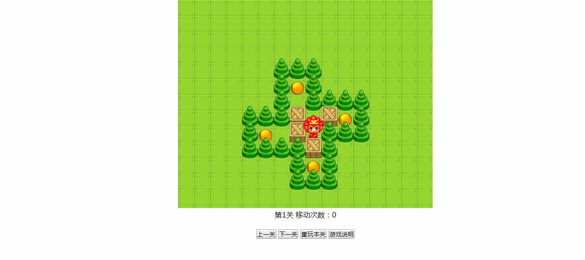

### 小人推箱子游戏

### 实现效果图如下



### 分析

* 四个小人,分别为四张上下左右的图片组合而成
* 挡墙,背景,陷阱
* 100个地图路径,两个数组保存的路径
* 地图示用数组来存储的,0代表的是背景的位置,1对应的是外围的挡墙,箱子对应的是3，陷阱对应的是2,小人对应的是4,整个地图,我们要把图片给加载进来,画在那么一个位置上,其实是和数组进行对应起来,数组和图片一一对应,5代表的是箱子就在这个球上

### 实现代码如下

```
<!doctype html>
<html lang="en">

<head>
    <meta charset="UTF-8">
    <meta name="Keywords" content="关键词">
    <meta name="Description" content="描述">
    <title>Document</title>
    <style>
    * {
        margin: 0px;
        padding: 0px;
    }
    body{
        text-align:center;
    }
    #myCanvas{
        margin:0 auto;
    }
    </style>
</head>

<body onload="init();" onkeydown="DoKeyDown(event);">
    <!--身体-->
    <canvas id="myCanvas" width="560" height="460">
        您的浏览器不支持canvas标签，请您更换浏览器！！！
    </canvas>
    <div id="msg"></div>
    
    
    
    
    
    
    
    <br />
    <input type="button" value="上一关" onclick="NextLevel(-1);">
    <input type="button" value="下一关" onclick="NextLevel(1);">
    <input type="button" value="重玩本关" onclick="NextLevel(0);">
    <input type="button" value="游戏说明" onclick="ShowHelp();">
    <script src="js/mapdata100.js"></script>
    <script>
    var w = 35;
    var h = 35;
    var curMap;
    var CurLevel;
    var iCurLevel = 0; //关卡数
    var MoveTimes = 0; //移动次数
    var myCanvas = document.getElementById("myCanvas");
    var context = myCanvas.getContext("2d");
    var block = document.getElementById("block");
    var wall = document.getElementById("wall");
    var box = document.getElementById("box");
    var ball = document.getElementById("ball");
    var pup = document.getElementById("pup");
    var pdown = document.getElementById("pdown");
    var pleft = document.getElementById("pleft");
    var pright = document.getElementById("pright");
    var msg = document.getElementById("msg");
    //位置
    function Point(x, y) {
        this.x = x;
        this.y = y;
    }
    var per_position = new Point(5, 5);


    function InitMap() {
        for (var j = 0; j < 16; j++) {
            for (var i = 0; i < 16; i++) {
                context.drawImage(block, w * i, h * j, w, h);
            }

        }
    }
    //InitMap();

    // DoKeyDown(event);
    //初始化游戏，初始化地图，初始化数据
    function init() {
        initLevel(); //游戏等级
        showMoveInfo() //游戏数据
    }
    //画出每个游戏关卡
    function DrawMap(level) {
        for (var i = 0; i < level.length; i++) {
            for (var j = 0; j < level[i].length; j++) {
                var pic = block;
                switch (level[i][j]) {
                    case 1:
                        pic = wall;
                        break;
                    case 2:
                        pic = ball;
                        break;
                    case 3:
                        pic = box;
                        break;
                    case 4:
                        pic = curMan;
                        per_position.x = i;
                        per_position.y = j;
                        break;
                    case 5:
                        pic = box;
                        break;
                }
                context.drawImage(pic, w * j - (pic.width - w) / 2, h * i - (pic.height - h),
                    pic.width, pic.height);
            }
        }
    }
    //DrawMap(curMap);
    //游戏等级
    function initLevel() {
        curMap = copyArray(levels[iCurLevel]); //初始化地图
        CurLevel = copyArray(levels[iCurLevel]); //当前等级的地图
        curMan = pdown; //让小人回到初始状态
        InitMap();
        DrawMap(curMap); //画出当前的地图
    }
    //initLevel()
    function NextLevel(i) {
        iCurLevel = iCurLevel + i;
        if (iCurLevel < 0) {
            iCurLevel = 0;
            return;
        }
        var len = levels.length;
        if (iCurLevel > len - 1) {
            iCurLevel = len - 1;
            return;
        }
        initLevel();
        MoveTimes = 0;
        showMoveInfo();
    }
    //NextLevel(1)
    //游戏数据
    function showMoveInfo() {
        msg.innerHTML = "第" + (iCurLevel + 1) + "关 移动次数：" + MoveTimes;
        showhelp = false;
    }
    //游戏说明
    var showhelp = false;

    function ShowHelp() {
        showhelp = !showhelp;
        if (showhelp) {
            msg.innerHTML = "用键盘上的上、下、左、右键移动小人，把箱子全部推到小球的位置即可过关。箱子只可向前推，不能往后拉，并且小人一次只能推动一个箱子。";
        } else {
            showMoveInfo();
        }
    }
    //小人移动特效
    function go(dir) {
        var p1;
        var p2;
        switch (dir) {
            case "up":
                curMan = pup;
                p1 = new Point(per_position.x - 1, per_position.y);
                p2 = new Point(per_position.x - 2, per_position.y);
                break;
            case "down":
                curMan = pdown;
                p1 = new Point(per_position.x + 1, per_position.y);
                p2 = new Point(per_position.x + 2, per_position.y);
                break;
            case "left":
                curMan = pleft;
                p1 = new Point(per_position.x, per_position.y - 1);
                p2 = new Point(per_position.x, per_position.y - 2);
                break;
            case "right":
                curMan = pright;
                p1 = new Point(per_position.x, per_position.y + 1);
                p2 = new Point(per_position.x, per_position.y + 2);
                break;
        }
        if (TryGo(p1, p2)) {
            this.MoveTimes++;
            showMoveInfo();
        }

        InitMap();
        DrawMap(curMap);

        if (CheckFinish()) {
            alert("恭喜过关");
            NextLevel(1);
        }
    }
    //判断小人是否能移动
    function TryGo(p1, p2) {
        if (p1.x < 0) return false; //若果超出地图的左边，不通过
        if (p1.y < 0) return false; //若果超出地图的上边，不通过
        if (p1.x > curMap.length) return false; //若果超出地图的左右边，不通过
        if (p1.y > curMap[0].length) return false; //若果超出地图的下边，不通过
        if (curMap[p1.x][p1.y] == 1) return false; //若果是墙 ，不能通行
        if (curMap[p1.x][p1.y] == 3 || curMap[p1.x][p1.y] == 5) {
            if (curMap[p2.x][p2.y] == 1 || curMap[p2.x][p2.y] == 3) {
                return false;
            }
            curMap[p2.x][p2.y] = 3;
        }

        curMap[p1.x][p1.y] = 4;
        //console.log(4);
        var v = CurLevel[per_position.x][per_position.y];
        if (v != 2) {
            if (v == 5) {
                v = 2;
            } else {
                v = 0;
            }
        }
        curMap[per_position.x][per_position.y] = v;
        //console.log(per_position.x+":"+per_position.y);
        per_position = p1;
        //console.log(per_position.x+":"+per_position.y);
        return true;
    }
    //判断是否推成功
    function CheckFinish() {
        for (var i = 0; i < curMap.length; i++) {
            for (var j = 0; j < curMap[i].length; j++) {
                if (CurLevel[i][j] == 2 && curMap[i][j] != 3 || CurLevel[i][j] == 5 &&
                    curMap[i][j] != 3) {
                    return false;
                }

            }
        }
        return true;
    }

    function DoKeyDown(event) {
        switch (event.keyCode) {
            case 37:
                go("left");
                break;
            case 38:
                go("up");
                break;
            case 39:
                go("right");
                break;
            case 40:
                go("down");
                break;
        }
    }
    //克隆二维数组
    function copyArray(arr) {
        var b = [];
        for (var i = 0; i < arr.length; i++) {
            b[i] = arr[i].concat(); //数组连接
        }
        return b;
    }
    </script>
</body>

</html>

```
